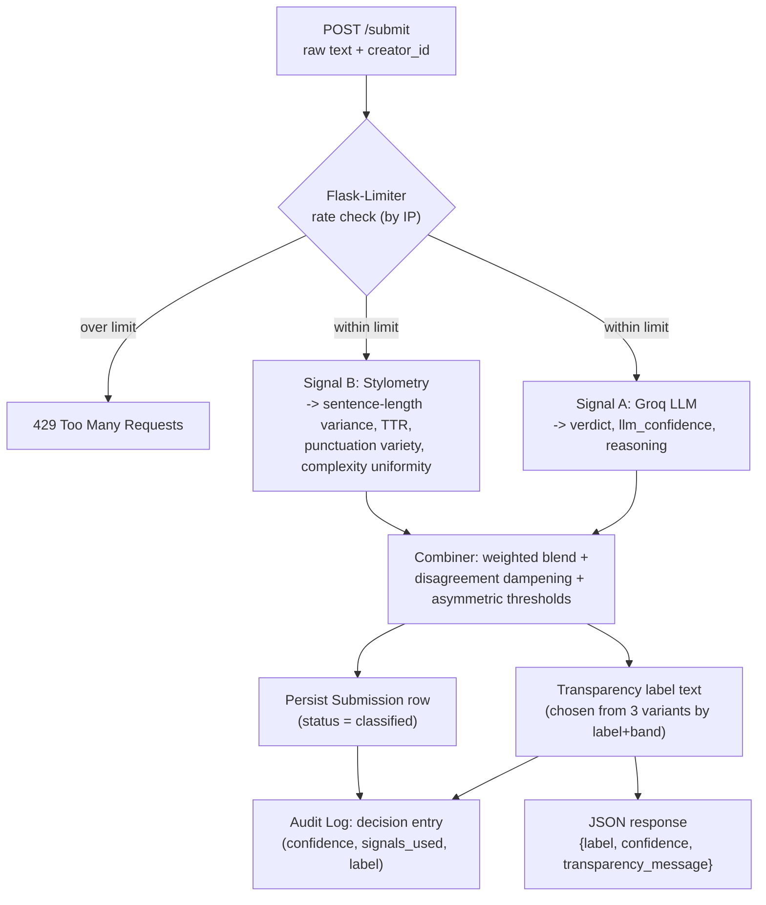
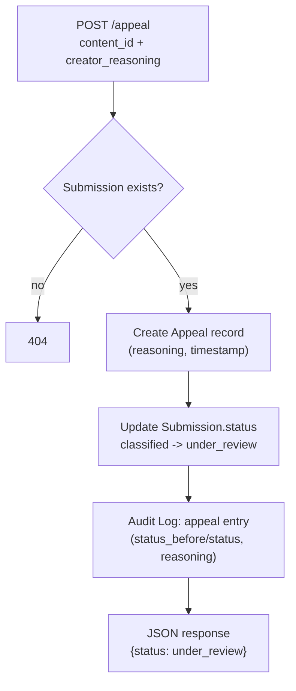

# Provenance Guard

## Project Overview

Provenance Guard is a backend that provides services for writing platforms to use to classify submitted text (a poem, a short story excerpt, a blog post) as likely AI generated, likely human written, or uncertain. It returns a calibrated confidence score alongside a plain language transparency label a reader would actually see, and gives creators a way to contest a decision they believe is wrong by filing an appeal. It's built around one central design constraint: on a writing platform, falsely accusing a human of using AI is worse than missing a genuine AI submission, so the whole pipeline is biased toward that asymmetry rather than treating both error types as equal.

## Features

- **Content submission endpoint** (`POST /submit`): accepts raw text and returns the attribution result, confidence score, and transparency label.
- **Multi-signal detection pipeline**: two different signals (an LLM semantic judgment and stylometric heuristics) feed a single combiner.
- **Confidence scoring with calibrated uncertainty**: a continuous score, with asymmetric thresholds so a false "AI" accusation requires more evidence than a "human" clearance.
- **Transparency label**: one of three exact, plain language strings shown to the reader, chosen by the confidence band.
- **Appeals workflow** (`POST /appeal`): captures a creator's reasoning, flips the submission's status to `under_review`, and logs the appeal next to the original decision.
- **Rate limiting**: Flask-Limiter on `/submit`, tuned for realistic writer usage vs. abuse.
- **Structured audit log** (`GET /log`): every decision and every appeal, with both individual signal scores and the combined result.

## Tech Stack

- **API framework:** Flask
- **Detection signal 1:** Groq (`llama-3.3-70b-versatile`)
- **Detection signal 2:** stylometric heuristics (Python)
- **Rate limiting:** Flask-Limiter (in-memory storage)
- **Storage / audit log:** SQLite

## Setup

```
python3 -m venv .venv
source .venv/bin/activate
pip install -r requirements.txt
```

Create a `.env` file with `GROQ_API_KEY=<your key>`.

## Run

```
python app.py
```

Runs on `http://127.0.0.1:5000`.

## API

### `POST /submit`

Rate limited to 10/minute, 100/day per IP (see Rate Limiting below).

```
curl -s -X POST http://127.0.0.1:5000/submit \
  -H "Content-Type: application/json" \
  -d '{"text": "your text here", "creator_id": "test-user-1"}' | python -m json.tool
```

Returns `content_id`, `attribution` (`likely_ai`/`likely_human`/`uncertain`), `confidence` (0.50-0.99), `label` (the exact transparency text, see below), and a `signals` object with both detection signals' raw output.

### `POST /appeal`

```
curl -s -X POST http://127.0.0.1:5000/appeal \
  -H "Content-Type: application/json" \
  -d '{"content_id": "PASTE-CONTENT-ID-HERE", "creator_reasoning": "I wrote this myself from personal experience."}' | python -m json.tool
```

Looks up the submission, records the appeal, and flips its status to `under_review`. No automated re-classification. Returns `404` if the `content_id` doesn't exist, `400` if `creator_reasoning` is missing or under 10 characters, `409` if the submission is already under review.

### `GET /log`

Returns the audit log with most recent first: `curl -s http://127.0.0.1:5000/log | python -m json.tool`.

## Architecture

A submission enters through `POST /submit` with the raw text and a `creator_id`. Flask-Limiter checks the request's IP against the rate limit first. If it passes, the text goes to both signals (the Groq LLM call and the Python stylometry calculation), the combiner merges them into one label and confidence using asymmetric thresholds, and the result is persisted alongside a transparency label and a decision entry in the audit log before the response is returned. An appeal looks up the submission, records the creator's reasoning, changes `status` to `under_review`, and appends an appeal entry to the audit log referencing the original decision. No re-classification happens automatically.





## Detection signals

**Groq LLM judgment** (`llama-3.3-70b-versatile`) reads the whole text and judges holistic semantic and stylistic coherence: does it contain specific, idiosyncratic, lived detail, or does it read as generically smooth and scaffolded? This was chosen because it's the only one of the two signals that can look at meaning rather than just shape. It can, for example, tell a repetitive poem's refrain apart from a generic AI paragraph's filler, something a purely statistical signal cannot do. What it misses: it's biased toward formal/technical registers reading as "AI" (an academic paragraph and an AI paragraph are both plainer than casual writing), it can't reliably catch AI text that's been lightly paraphrased by a human afterward, and its output is a somewhat noisy language model judgment rather than a deterministic measurement.

**Stylometric heuristics** (pure Python) measure four purely structural properties: sentence length variance, vocabulary diversity (type token ratio), punctuation variety, and sentence complexity uniformity. This was chosen specifically because it's independent of the LLM signal on a different axis. It never looks at meaning, only measurable shape, so it's cheap, deterministic, and stays available if Groq is down. What it misses: it can't tell a deliberately repetitive human poem from actual AI uniformity (both look identical at the level of "low variance, low vocabulary diversity"), and at the short lengths typical of a real submission (well under 200 words), some of these measurements (vocabulary diversity especially) carry much less signal than they would over a long document, since there just isn't room for much repetition either way.

These two signals are independent. One reads for content, the other for shape, which is what makes their combination more informative than either alone, and what makes their disagreement itself a meaningful signal (see Confidence scoring).

**If deploying for real:** the stylometry reference constants here were hand calibrated against a handful of test texts (documented in `planning.md`), not a labeled corpus. Before trusting this in production, those constants and the 0.70/0.35 combined thresholds should be validated against a much larger, more diverse labeled dataset spanning genres, registers, and non-native English writing, since the current calibration is only known to behave well on the small test set actually used to tune it.

## Confidence scoring

The two signals are each converted to a 0-1 "AI-likelihood" score (0 = confidently human, 1 = confidently AI, 0.5 = no signal), then combined:

1. **Weighted blend:** `0.65 * llm_score + 0.35 * style_score` .The LLM is primary since it directly answers the question asked; stylometry corroborates.
2. **Disagreement dampening:** if the two signals lean in opposite directions and both leans are non-trivial, the combined score is pulled halfway back toward neutral before thresholding. Active disagreement between two independent signals is itself evidence of uncertainty, not something an average should paper over.
3. **Asymmetric thresholds:** `>= 0.70` -> `ai`, `<= 0.35` -> `human`, otherwise -> `uncertain`. The gap between neutral (0.5) and the AI threshold (0.70) is wider than the gap to the human threshold (0.35), so it deliberately takes more agreement to accuse than to clear.
4. **Display confidence** is rescaled per band so the number itself is meaningful: `uncertain` always shows in 0.50-0.79, `ai`/`human` always show in 0.80-0.99 so a 0.51 and a 0.95 are guaranteed to read as different kinds of results, not just different decimals.

**How this was validated:** 4 texts spanning the intended range (clearly AI, clearly human, a formal but human borderline case, a lightly edited AI borderline case) were run end-to-end and checked against intuition, printing both signals' raw scores whenever a result looked wrong. This process caught two real bugs: a stylometry feature that was silently contributing nothing, and the LLM initially misreading formal academic writing as AI, which are both fixed and documented in `planning.md`.

**Two example submissions, actual scores from a real run:**

- **High-confidence:** a casual restaurant review ("ok so i finally tried that new ramen place downtown and honestly? underwhelming...") -> `likely_human`, confidence **0.88**.
- **Lower-confidence:** a formal, human-written paragraph about monetary policy and asset price inflation -> `uncertain`, confidence **0.63**. The stylometric signal alone leaned AI-like (formal writing reads structurally uniform), but the LLM signal backed off to neutral rather than confidently agreeing, and the combiner correctly refused to produce a confident verdict from a single leaning signal.

**If deploying for real:** the exact threshold values (0.70, 0.35) and blend weights (0.65/0.35) were chosen from principle (the false-positive asymmetry) and checked against only a handful of hand-picked texts. They should be re-validated against a larger labeled set, and the LLM prompt should be re-audited periodically since its behavior can shift across model versions.

## Transparency label

Exactly one of these three strings is returned as `label` on every submission, chosen by the combined confidence band:

- **High-confidence AI:** "This content is likely AI-generated (confidence: high). Our system found strong, consistent signals of AI authorship across both semantic analysis and writing pattern analysis. If you believe this is incorrect, you can appeal this decision."
- **High-confidence human:** "This content appears to be human written (confidence: high). Our checks found no strong indicators of AI generation."
- **Uncertain:** "We can't confidently determine whether this was written by a person or AI. This is not an accusation. Our signals simply didn't agree strongly enough to make a call. If you have context that would help, you're welcome to appeal."

## Rate limiting

`POST /submit` is limited to **10 requests per minute and 100 per day, per IP address** (Flask-Limiter, in-memory storage). Keyed by IP rather than the self-reported `creator_id`, since this project has no authentication and a client could otherwise rotate `creator_id` per request to dodge a per creator limit.

- 10/minute is generous for a real writer submitting or revising drafts in one sitting (nobody submits a new piece every few seconds) while making a scripted flood immediately rate capped instead of able to hammer the paid Groq API or probe the confidence thresholds at will.
- 100/day bounds sustained cost, since every submission triggers a paid LLM call, while still comfortably covering someone submitting many distinct pieces across a day.

Evidence (12 rapid requests against a freshly-started server; first 10 succeed, the rest are rejected):

```
$ for i in $(seq 1 12); do
    curl -s -o /dev/null -w "%{http_code}\n" -X POST http://127.0.0.1:5000/submit \
      -H "Content-Type: application/json" \
      -d '{"text": "This is a test submission for rate limit testing purposes only.", "creator_id": "ratelimit-test"}'
  done
201
201
201
201
201
201
201
201
201
201
429
429
```

## Appeals workflow

A creator appeals with just a `content_id` and their reasoning (see `POST /appeal` above). The submission's status flips from `classified` to `under_review`, and the appeal is appended to the audit log next to the original decision it's contesting. No re-classification happens automatically; a human is expected to read `GET /log` and decide. See `planning.md` section 4 for the full design.

## Audit log

Every decision and every appeal is written to a structured SQLite-backed log (`storage.py`), retrievable via `GET /log`. Example entries from a real run include a decision, another decision, and the appeal filed against the first one:

```json
{
  "attribution": "likely_ai",
  "combined_score": 0.7742,
  "confidence": 0.85,
  "content_id": "7ee7e519-e654-4670-9d79-53264d489c06",
  "creator_id": "writer-42",
  "event_type": "decision",
  "llm_score": 0.9,
  "status": "classified",
  "style_score": 0.5406,
  "timestamp": "2026-07-05T03:41:20.646Z"
}
```
```json
{
  "attribution": "likely_human",
  "combined_score": 0.2107,
  "confidence": 0.88,
  "content_id": "603dd81c-c1da-4fdc-8d9e-d04258b1d649",
  "creator_id": "writer-17",
  "event_type": "decision",
  "llm_score": 0.1,
  "status": "classified",
  "style_score": 0.4162,
  "timestamp": "2026-07-05T03:41:20.949Z"
}
```
```json
{
  "appeal_id": "98b67451-f6ba-430f-b4eb-c8c522abc4c3",
  "appeal_reasoning": "I wrote this myself from personal experience. I am a non-native English speaker and my writing style may appear more formal than typical.",
  "content_id": "7ee7e519-e654-4670-9d79-53264d489c06",
  "creator_id": "writer-42",
  "event_type": "appeal",
  "status": "under_review",
  "status_before": "classified",
  "timestamp": "2026-07-05T03:41:21.983Z"
}
```

Each decision entry captures both individual signal scores (`llm_score`, `style_score`) alongside the combined result, and each appeal entry references the `content_id` it contests plus the status transition, so the two entries above read together as one audit trail for that submission.

## Known limitations

The clearest specific failure case: **a poem piece that uses deliberate repetition and simple vocabulary** (a memorial poem) will score AI-like on the stylometric signal alone. Both of that signal's most heavily weighted features (sentence length variance and vocabulary diversity) are calibrated on the assumption that low variance and low diversity indicate AI-style uniformity, but a human using an intentional refrain produces exactly the same statistical shape as that uniformity, because the feature only measures shape, not why the shape exists. In this system that's caught by the LLM signal reading the actual content and by the asymmetric threshold refusing to confidently accuse from one leaning signal.

## Spec reflection

**How the spec helped:** deciding the asymmetric threshold principle and writing out exactly what a 0.6 confidence score should mean to a user turned out to matter in Milestone 4. When testing surfaced a real false positive (a human written formal paragraph scored confidently "ai"), the fix was unambiguous: the false positive averse asymmetry was already the documented design intent, so the right fix was to improve the LLM signal's prompt, not to loosen the thresholds to paper over a bad signal.

**Where implementation diverged from the spec:** the original `planning.md` appeals design required the creator to resend their `creator_id` on an appeal, to check it against the original submission's owner. The actual required endpoint contract only sends `{content_id, creator_reasoning}` (there's no `creator_id` field to check). Rather than add a field the spec's own required interface doesn't have, that ownership check was dropped, and the creator identity used for logging is read back from the stored submission instead. This is a real gap (anyone holding a `content_id` can currently file an appeal), but still the project has no authentication layer.

## AI usage

1. **Stylometry vocabulary-diversity feature.** I directed AI to implement the type token ratio feature from the spec's formula (calibrated with a midpoint suited to long documents). Testing it against the actual short submission length texts used in Milestone 4 showed the feature saturating to 0 for every single input. It was silently contributing nothing to the combined score. This was caught by printing the intermediate per-feature scores during verification rather than trusting the combined output alone, and the reference constants were fine tuned again against the real test texts.
2. **Confidence display-formula bug.** The AI's first implementation of the per-band display confidence formula let the minimum evidence floor override (short text forced from `ai` to `uncertain`) leak a confidence value above the uncertain band's intended 0.79 ceiling. A borderline text ended up labeled "uncertain" but displayed with 0.88 confidence, defeating the point of the override. Caught by testing the exact short borderline text from the milestone's own test set and comparing the output against the band ranges, then the clamping logic was rewritten to cap per-band rather than globally.
