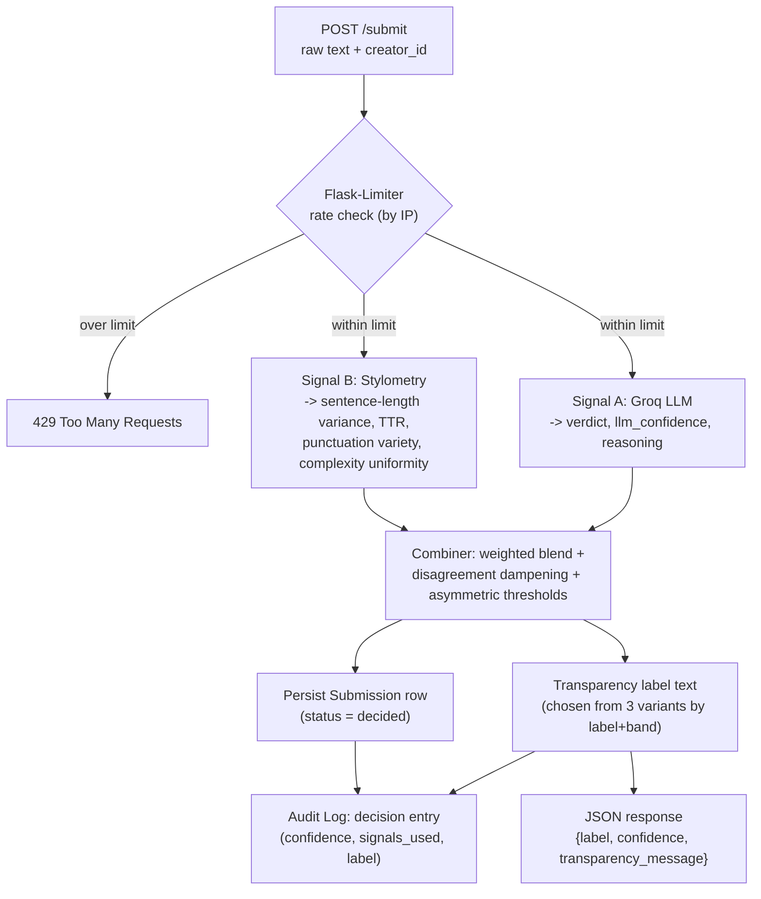
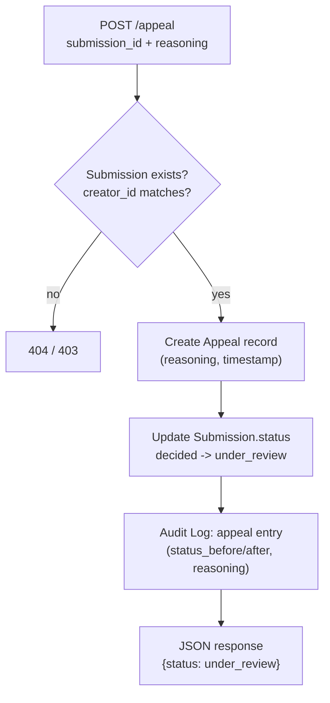

# Provenance Guard Planning

## 1. Detection Signals

**Signal A: Groq LLM Semantic Classification (llama-3.3-70b-versatile).** Sent the raw text with a system prompt instructing it to judge holistic semantic and stylistic coherence and return strict JSON: `{"verdict": "ai"|"human"|"uncertain", "llm_confidence": 0.0-1.0, "reasoning": "one sentence"}`. The prompt explicitly tells the model to answer "uncertain" rather than guess when unsure, and to lean toward "human" or "uncertain" over "ai" when torn, matching the project's false-positive-averse stance. M4 testing surfaced a real failure mode here: the model initially rated a formal, human-written academic paragraph as confidently AI (0.9) purely because of its formal register. The prompt was updated to explicitly state that formal, technical, or academic writing is not evidence of AI by itself; after that change the same text correctly resolved to "uncertain" instead of a confident false accusation. Converted to a single value `p_llm` in [0,1] (0 = confidently human, 1 = confidently AI, 0.5 = neutral):
- `verdict == "ai"` -> `p_llm = 0.5 + 0.5 * llm_confidence`
- `verdict == "human"` -> `p_llm = 0.5 - 0.5 * llm_confidence`
- `verdict == "uncertain"` -> `p_llm = 0.5`

**Signal B: Stylometric heuristics.** Four measurements, each normalized to its own 0 to 1 "AI-likeness" score using a fixed linear reference formula (0 = human-like, 1 = AI-like, 0.5 = neutral), then combined with fixed weights. Reference constants below are initial estimates grounded in general stylometry patterns; they get hand-tuned against sample texts during M4 verification, not treated as final.

| Feature | What it measures | Formula (clamped to [0,1]) | Reasoning for constants |
|---|---|---|---|
| Sentence-length variance | Coefficient of variation (stdev/mean) of sentence lengths | `0.5 - (cv - 0.45) / 0.5` | Human prose CV is typically 0.5-0.7; AI text clusters tighter around 0.25-0.4. Midpoint 0.45, spread 0.5. |
| Vocabulary diversity | Type-token ratio over the first ~200 words | `0.5 - (ttr - 0.80) / 0.40` | At the length of a typical submission (well under 200 words), TTR runs high (0.85-0.95) for both AI and human text since little repetition is possible; the original midpoint of 0.45 (calibrated for long-document TTR) saturated to 0 for every M4 test input and stopped differentiating anything. Recalibrated against the milestone's own test texts to midpoint 0.80, spread 0.40, so it responds proportionally within the range short submissions actually fall in. |
| Punctuation variety | Count of distinct punctuation types used (period, comma, semicolon, colon, dash, ellipsis, exclamation, question mark, parenthesis; max 9) | `0.5 - (variety - 3.5) / 3.0` | Human writing typically uses 4-5 types; AI text leans on commas and periods only, typically 2-3 types. Midpoint 3.5, spread 3.0. |
| Sentence complexity uniformity | Standard deviation across sentences of a per-sentence clause count (commas + subordinating/coordinating conjunctions) | `0.5 - (stdev - 0.8) / 1.2` | Uniform complexity (low stdev, ~0.3) reads AI-like; varied complexity (high stdev, ~1.4) reads human-like. Midpoint 0.8, spread 1.2. |

Combined: `p_style = 0.30*ai_variance + 0.25*ai_ttr + 0.25*ai_punct + 0.20*ai_complexity` (weights sum to 1, so `p_style` stays in [0,1]; variance and vocabulary get the most weight as the more human-distinctive tells). If the submission is under 40 words, stylometry is statistically unreliable at that length, so `p_style` is forced to 0.5 (neutral, contributes nothing) rather than computed from noisy measurements.

**Combining into one confidence score:**
1. Weighted blend: `p_combined = 0.65 * p_llm + 0.35 * p_style` (LLM is primary since it directly answers the question asked; stylometry corroborates).
2. Disagreement dampening: if `p_llm` and `p_style` deviate from 0.5 in opposite directions and both deviations exceed 0.15, pull `p_combined` halfway back toward 0.5 before thresholding: `p_combined = 0.5 + (p_combined - 0.5) * 0.5`. Active disagreement between the two signals is itself evidence of uncertainty, not something a weighted average should paper over.
3. Minimum evidence floor: if the submission is under 40 words, the final label can never be `ai` even if `p_combined` would otherwise cross the AI threshold; it falls back to `uncertain` (it can still be `human`).

## 2. Uncertainty Representation

The confidence score answers "how sure is the system of the label it is showing," not "probability this specific text is AI." That distinction matters because it lets the score be asymmetric: a false accusation (calling a human's work AI) is worse than a false clearance on a writing platform, so it takes more evidence to cross into "AI" than to clear as "human."

**Thresholds on `p_combined`:**
- `p_combined >= 0.70` -> label `ai`
- `p_combined <= 0.35` -> label `human`
- otherwise -> label `uncertain`

The AI-side dead zone (0.50 to 0.70, a 0.20 span) is wider than the human-side dead zone (0.35 to 0.50, a 0.15 span). Borderline-AI-looking text defaults to "uncertain" more readily than borderline-human-looking text does.

**Display confidence** (what the user actually sees) is rescaled per band so the number itself carries meaning:
- AI band: `confidence = 0.80 + 0.19 * ((p_combined - 0.70) / 0.30)`, clamped to [0.80, 0.99]
- Human band: `confidence = 0.80 + 0.19 * ((0.35 - p_combined) / 0.35)`, clamped to [0.80, 0.99]
- Uncertain band: if `p_combined >= 0.5`, `confidence = 0.50 + 0.29 * ((p_combined - 0.5) / 0.20)`; if `p_combined < 0.5`, `confidence = 0.50 + 0.29 * ((0.5 - p_combined) / 0.15)`; clamped to [0.50, 0.79]

**What 0.6 means concretely:** `p_combined = 0.6` falls inside the uncertain band (0.35 to 0.70). Display confidence works out to `0.50 + 0.29 * (0.10/0.20) = 0.645`, so the user sees roughly 0.65 next to an "Uncertain" label. That reads as "leans slightly toward AI, but this is closer to a coin flip than a verdict, treat it as inconclusive," which is the intended meaning: 0.6 should never look like a near-final answer.

By construction, `0.51` always lands in the uncertain band (display range 0.50-0.79) and `0.95` always lands in a high-confidence band (display range 0.80-0.99), so the two numbers always produce visibly different labels, not just different decimals.

## 3. Transparency Label Design

- **High-confidence AI:** "This content is likely AI-generated (confidence: high). Our system found strong, consistent signals of AI authorship across both semantic analysis and writing-pattern analysis. If you believe this is incorrect, you can appeal this decision."
- **High-confidence human:** "This content appears to be human-written (confidence: high). Our checks found no strong indicators of AI generation."
- **Uncertain:** "We can't confidently determine whether this was written by a person or AI. This is not an accusation. Our signals simply didn't agree strongly enough to make a call. If you have context that would help, you're welcome to appeal."

Reviewed against a plain reading test (would a non-technical reader think this is an accusation or a hedge, and is that the intended read): the "uncertain" text keeps a neutral tone and states directly that it is not an accusation, so it does not read as a soft version of "AI"; the "AI" text is the only one carrying an appeal prompt inline (since it is the only outcome directly accusing someone, it carries the most obligation to point at the remedy) while "uncertain" also mentions appeal since a creator may still want to contest an inconclusive call.

## 4. Appeals Workflow

**Who can submit:** anyone holding a `content_id`, in practice the creator who owns that submission. The implemented request is `{content_id, creator_reasoning}` only; there is no `creator_id` field to check against the original submission, so the ownership-match check from an earlier draft of this section was dropped. The creator identity used for logging is read back from the original submission record via `content_id`. Since this project has no authentication layer, this was already a soft check rather than a security boundary, so nothing enforceable was lost.

**What they provide:** `content_id` and `creator_reasoning` (free text, minimum 10 characters, explaining why they believe the label is wrong).

**What the system does on receipt (`POST /appeal`):**
1. Validation: looks up the submission by `content_id`; returns 404 if it does not exist, 400 if `creator_reasoning` is missing or too short, 409 if the submission is already `under_review`.
2. Creates an `Appeal` record (`appeal_id`, `content_id`, `creator_reasoning`, `submitted_at`).
3. Updates the submission's `status` from `classified` to `under_review`. No re-classification runs automatically.
4. Appends an audit log entry with `event_type: "appeal"`, the reasoning, and `status_before`/`status`, so the appeal is tied to the original decision's audit trail rather than floating separately.
5. Returns `201` with `{appeal_id, content_id, status: "under_review", message}`.

**What a human reviewer sees**: `GET /log` already surfaces the appeal and its original decision together for review.

## 5. Anticipated Edge Cases

- **Formulaic human writing (false positive risk).** A poem using deliberate repetition, refrain, and simple vocabulary (for example, a memorial poem) produces low sentence-length variance and low type-token ratio, both of which score AI-like on the stylometric signal, even though the repetition is an intentional poetic device written by a person. The asymmetric threshold and the LLM's semantic read are what keep this from becoming a confident "ai" label, but the stylometric signal alone would misread it.
- **Non-native English writing (false positive risk).** An essay from a non-native English speaker often uses simpler, more repetitive sentence structures and a narrower vocabulary range as a byproduct of language-learning constraints, not AI generation. This can push both signals toward "AI-like" for reasons that have nothing to do with authorship, which is a fairness concern the system does not fully solve.
- **Lightly edited AI text (false negative risk).** Text originally generated by an LLM and then paraphrased or rewritten by a human tends to break the statistical uniformity stylometry looks for and can read as more "human" to the LLM judge as well, since both signals are tuned to catch raw generation.

## Architecture

A submission enters through `POST /submit` with the raw text and a `creator_id`. Flask-Limiter checks the request's IP against the rate limit first. If it passes, the text goes to both signals in parallel (the Groq LLM call and the pure-Python stylometry calculation), the combiner merges them into one label and confidence using the asymmetric thresholds above, and the result is persisted alongside a transparency label and a decision entry in the audit log before the response is returned. An appeal (`POST /appeal`) looks up the submission, records the creator's reasoning, flips `status` to `under_review`, and appends an appeal entry to the audit log referencing the original decision. No re-classification happens automatically.

## AI Tool Plan

**M3 (submission endpoint + first signal).**
- Spec sections to provide: Detection Signals section 1 (the Groq LLM signal spec, including the exact JSON output shape) and the submission-flow diagram.
- What to ask for: a Flask app skeleton with a `POST /submit` route that validates `creator_id`/`title`/`content` and handles the length cap and error cases, plus a separate `llm_signal.py` function that calls Groq in JSON mode and returns `{verdict, llm_confidence, reasoning}`.
- Verification: call `llm_signal.py` directly, not through the endpoint yet, on 3-4 hand-picked texts (obviously AI-generated, obviously human, one ambiguous), and manually check the verdict and reasoning look sane; confirm a malformed or unparseable model response is handled without crashing before wiring it into `/submit`.

**M4 (second signal + confidence scoring).**
- Spec sections to provide: Detection Signals section 2 (the four stylometric features with their reference constants) and the Uncertainty Representation section (thresholds and confidence formulas), and the diagram's combiner box.
- What to ask for: `stylometry.py` implementing the four measurements and `p_style`, and `combine.py` implementing the weighted blend, disagreement dampening, thresholds, and display-confidence mapping.
- Verification: run the combiner on the same 3-4 texts from M3 and the human poem edge case from section 5, and confirm the scores actually differ meaningfully (clearly-AI text lands above 0.80 on the AI side, clearly-human text above 0.80 on the human side, the ambiguous and formulaic-human cases land in 0.50-0.79) rather than clustering near one value regardless of input.

**M5 (production layer).**
- Spec sections to provide: Transparency Label Design section (the three exact label strings) and the Appeals Workflow section (status transitions, appeal queue shape), and the appeal-flow diagram.
- What to ask for: label-generation logic that maps `(label, confidence band)` to the exact stored strings, and the `POST /appeal` and `GET /appeals` endpoints, and audit log writes for both decision and appeal events.
- Verification: submit three texts engineered to land in each of the three bands and confirm the exact label text and confidence range shown for each; submit an appeal against one of them and confirm `status` flips to `under_review`, the appeal shows up in `GET /appeals`, and both the original decision and the appeal appear together in `GET /log`.
